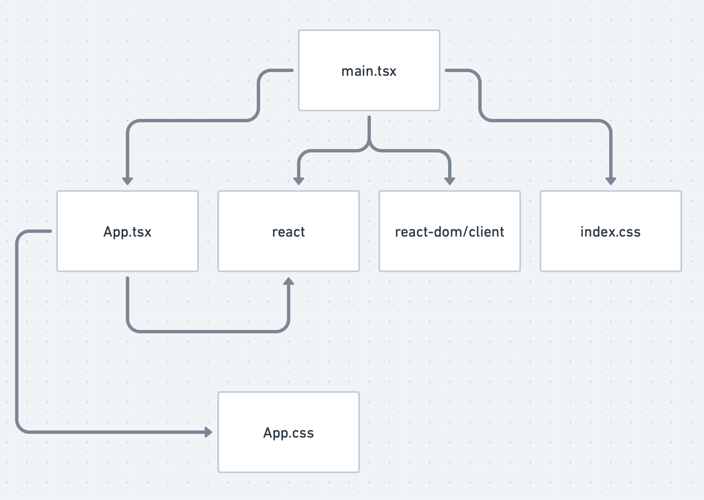

A modern JavaScript toolchain can be complex. Part of the complexity is the fact you can use JavaScript on the server and in the browser - so often you have, in fact, *two* toolchains. A lot of the time, it's really convinient to have these in a single repository, and this can lead to complexity, since often both the server and client projects are using or even sharing parts of the toolchain (such as using TypeScript for both the front and back end).

In addition, most front end projects will make use of a bunch of tools that *run* in Node.js. After everything is said and done, you end up with lot of moving parts, some of which you might not understand.

This post will focus on a front end project and describe all the different tools, what they do and why they are useful.

The example project uses Vite for the dev server and React for the frontend framework. The same concepts are applicable to any combination of tools, though. 

You can generate the project by running `npm create vite@latest my-app -- --template react-ts`.

# Source Code

In Vite, the entry point to your application is the `index.html` file. This is where everything starts.

```html
<!DOCTYPE html>
<html lang="en">
  <head>
    <!-- ... -->
  </head>
  <body>
    <div id="root"></div>
    <script type="module" src="/src/main.tsx"></script>
  </body>
</html>
```

The interesting part is `<script src="/src/main.jsx">`. This is where our code goes. Notice the extension - `tsx`. To get this to a state where it can run in a browser, it needs to be JavaScript - something that is valid in a `js` file. This is where the rabbit hole begins!

# Compilers

`jsx` is "JSX is a syntax extension for JavaScript that lets you write HTML-like markup inside a JavaScript file" as noted in the [React docs](https://react.dev/learn/writing-markup-with-jsx). It's not a new language, but an "extension" to JavaScript. We still need some way to handle that, though.

As a refresher, without JSX, if you want to do:

```tsx
function Foo () {
  const foo: string = 'OK'
  return <div>{foo}</div>
}
```

You'd need to write:

```js
import React from 'react'

function Foo () {
  return React.createElement('div', null, 'OK')
}
```

It's not nearly as concise or readable. 

So, we need a *compiler*. Originally, this was done using [Babel](http://babeljs.io). When you use Vite, it's done using [esbuild](https://esbuild.github.io). More on that later.

Even if you compile the JSX, you are still left with TypeScript. You'll need a compiler to handle that, too. Luckily, Babel has a plugin system, so you can teach it about both JSX and TypeScript. And esbuild knows how to handle both out of the box!

## Compilers Are Cool!

Compilers are neat! They are complex! But they can be beautiful! Most of them have a few fundamental steps. Some of them are:

1. Parse. This is when the code is broken into tokens. 
2. Transform. You take the parsed output and manipulate it in some fashion.
3. Code Generation. Output the newly transformed representation into whatever you want!

I'm not a compiler expert - I just know enough to know how to debug basic issues, which is generally enough. You'll know enough soon, too, and debugging your tool chain won't be so frustrating.

# Bundlers

Once you turned your `main.tsx` into a JavaScript file, you'll see it includes a bunch of *other* files:

```tsx
import React from 'react'
import ReactDOM from 'react-dom/client'
import App from './App.tsx'
import './index.css'

ReactDOM.createRoot(document.getElementById('root')!).render(
  <React.StrictMode>
    <App />
  </React.StrictMode>,
)
```

None of these will "just work" in a browser! 

- `react` and `react-dom/client` aren't in your `src` directory. 
- `App.tsx` needs to be compiled (as discussed above)
- `./index.css` isn't even JavaScript!

What we need is a *module system* that performs *module resolution* and a *bundler* to merge it all together.

# Module Resolution

We need some way to know which modules to include in the final built files. This is usually done using a *module graph*. In our case, it would be something like:


